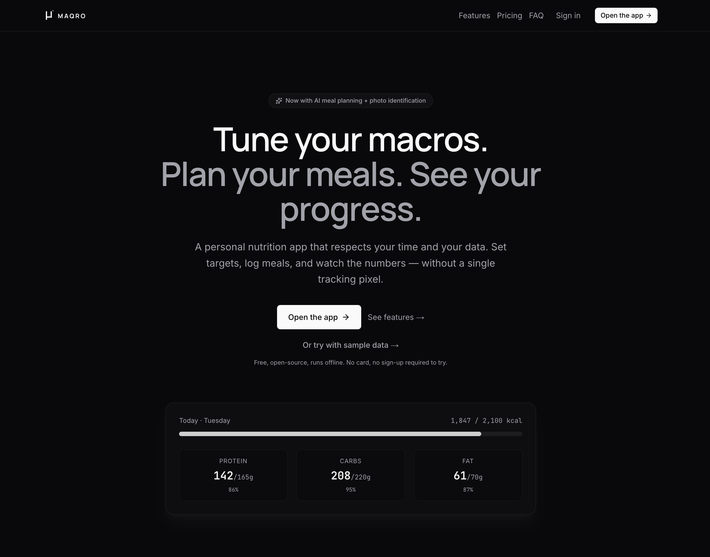

# Maqro

[](https://github.com/hyp3rd/maqro/actions/workflows/codeql.yml) [](https://github.com/hyp3rd/maqro/actions/workflows/gitleaks.yml)

## Join and use it for free at [macro.app](https://macro.app)

A personal macro calculator, meal planner, and weight-tracking journal.
Next.js app with a Supabase-backed optional account for multi-device
sync - or run it fully local in **guest mode** and everything lives in
your browser's IndexedDB. Installable as a PWA, works offline, and
ships with privacy-respecting operational logging.



## What it does

- **Calculator** - Mifflin–St Jeor BMR, TDEE from activity, target
  calories from a signed weekly weight-change rate (1 kg ≈ 7700 kcal,
  clamped at ±1%/week of bodyweight and floored at `max(BMR, 1200)`).
  Manual TDEE override for calibrating against real-world outcomes.
- **Meal Plan** - log foods against a per-profile set of meal slots
  (Breakfast / Lunch / Dinner / Snacks by default, fully editable in
  the Template editor). Auto-fill a day that hits your macro targets
  via a 3×3 linear solve over a protein/carb/fat triplet; portions
  snap to 5 g. Per-meal regenerate to refresh a single slot without
  blowing away the rest.
- **AI auto-fill (opt-in)** - Claude Sonnet 4.6 generates a coherent
  day (breakfasts that look like breakfasts), then a **programmatic
  coherence validator** rejects standalone-fat meals, multi-fish
  dinners, naked-carb mains, and snack monsters before the plan ever
  hits your screen. Falls back to the deterministic solver on every
  error path. Issues the validator can't get the AI to self-correct
  surface inline as **per-meal warning chips** with a one-tap
  "Regenerate this meal" action; day-level rules (low day protein)
  render as a single banner with a "Try refining" button.
  Plans are **personalized** with a soft bias toward foods you've
  actually been eating (top of the last ~30 days of logs) so the
  generated rotation looks like your rotation.
- **Daily logs** - every day's meals are persisted by `YYYY-MM-DD`
  key, with a date navigator to browse history without losing today's
  state.
- **Meal templates** - save any logged meal as a reusable template
  ("Greek yogurt bowl") and apply it to any slot on any day. Full
  template editor lets you rename slots, change defaults, and order
  them.
- **Recipes** - named bundles of ingredients with optional cuisine
  and prep notes. Build manually, generate via AI (now biased
  toward foods from your recent rotation), drag-to-reorder
  ingredients, **share via public URL** (auto-slug or custom for Pro)
  with `public` / `members-only` / `disabled` visibility. Apply a
  saved recipe to any meal slot and the dialog re-orders by
  per-serving macro fit to that slot's share of the day — the top
  recipe gets a **Best fit** badge when there's competition. A
  **Days** stepper in the same dialog writes the recipe to that meal
  slot across today + the next N-1 days (up to 7) — the "cook once,
  log for the week" meal-prep flow.
- **Weight history + Progress** - log weigh-ins; see a sparkline,
  macro-adherence chart, **streak counter** with **milestone
  celebrations** (3, 7, 14, 30, 60, 100, 180, 365 days), **plateau
  detection** (14-day flat run within ±0.5 kg), and **TDEE
  recalibration** suggestion when your observed weight change
  diverges from expected by more than 50 kcal/day. Charts are
  tap-to-expand on mobile for readable axis labels.
- **Body measurements** - optional waist / neck / hip log with a
  Catmull-Rom smoothed trend chart and a US Navy / Hodgdon–Beckett
  body-fat estimate (metric form). Stored locally and synced to
  Supabase like the rest of the journal data.
- **Shopping list** - aggregated from the meals you've planned across
  Today / This week / Next 7 days / Last 7 days. Copy-as-text for a
  partner's message thread or notes app.
- **Food search** - three sources merged into one box:
  - **Built-in** curated catalog
  - **My foods** (IndexedDB, custom entries via manual form, OFF
    search, or camera photo identification)
  - **Open Food Facts** live search via a same-origin proxy
- **Camera meal identification** - point your phone at a label or
  meal. Claude Sonnet 4.6 reads the photo, returns a structured macro
  breakdown, and one tap saves it to My Foods. The camera opens
  full-screen on mobile with a barcode-cutout reticle in scan mode;
  in photo mode, a multi-frame capture samples 6 frames over 1.5s
  and picks the sharpest (Laplacian-variance scoring) for the AI
  pass. Photo-identified meals can be promoted to a recipe directly
  from the review dialog so a recurring plate stops costing one AI
  generation per log.
- **Voice meal logging** (beta) - tap **Talk** on Add Food, dictate
  "200 grams of chicken and a banana", Claude Haiku parses it into
  structured foods you review before adding. Web Speech API where
  available (Chrome / Edge / Safari ≥ 14.5, mobile + desktop);
  textarea fallback on Firefox / Brave.
- **Share today** - tap Share on Daily Totals to push a server-
  rendered branded PNG of your day into iMessage, WhatsApp,
  Instagram Stories, Slack, etc. via Web Share API. Desktop falls
  back through image-clipboard → download. Receivers see a clean
  URL that unfurls into the same card on Twitter / LinkedIn via OG
  meta. Optional HMAC signing (set `SHARE_BADGE_SECRET`) prevents
  hand-crafted URLs from stamping fake numbers under the brand.
- **Account (optional)** - passwordless email OTP via Supabase.
  Profile, daily logs, weight history, body measurements, custom
  foods, meal templates, and recipes all sync across devices.
- **Passkeys (optional)** - WebAuthn sign-in via Face ID, Touch ID,
  Windows Hello, or a hardware key. Adding a passkey from
  Settings → Passkeys replaces both the email-code login AND the
  TOTP prompt on that device — the passkey itself is the second
  factor. Backed by Supabase's experimental passkey API; gated on
  the `auth.experimental.passkey` flag in
  [lib/supabase/client.ts](lib/supabase/client.ts).
- **Multi-factor (optional)** - enroll a TOTP authenticator app in
  Settings → Security. AAL2 is enforced both at the proxy (page
  navigations to `/app*` / `/admin*` redirect to the MFA challenge
  if the session is still at AAL1) AND at every authenticated API
  route — the back-button-from-TOTP bypass that affected many
  Supabase-based apps is closed. If a gated action (Auto-fill,
  Generate recipe, Cancel subscription, …) hits the AAL2 gate
  mid-session, an **in-app TOTP prompt** opens, you enter your
  code, and the original action retries automatically — no bounce
  to `/login`. Optional "Trust this device for 7 days" lets you skip
  TOTP from a remembered browser.
- **Backup email (optional)** - secondary recovery address verified
  via a code round-trip. If the primary email is lost (account
  closed, employer-managed inbox revoked) the backup keeps the
  user from getting locked out. Never used for marketing — recovery
  flow only.
- **Touch gestures** - swipe-to-delete + swipe-to-send on shopping
  list and pantry rows; horizontal swipe on the date strip
  advances days in the meal log. Touch-only (gated on
  `pointer: coarse`); desktop keeps the explicit buttons.
- **Multilingual** - English + Italian on the marketing pages with
  a locale switcher in the header. First visit auto-detects from
  the browser's Accept-Language; explicit picks persist via
  cookie. `next-intl` scaffold is single-locale-routed (no
  `/<locale>/...` URL prefix), so adding a new locale is a JSON
  file plus three lines in `lib/i18n/locale.ts`.
- **Signed-in devices** - Settings → Signed-in devices lists every
  active browser session, lets you rename them, and disconnect any
  remote one. A 12-hour grace window prevents a freshly-stolen
  session from immediately locking out the legitimate user; the
  kicked browser wipes its local data and signs out via a Realtime
  channel listener.
- **Reset device** - Settings → Reset device wipes this device's
  IndexedDB + localStorage and signs out, leaving the Supabase
  account intact. Useful for handing the device to someone else, or
  to recover from a corrupted local cache.
- **Try with sample data** - landing page "Try with sample data"
  link seeds a realistic week of meals / weights / body measurements
  into a fresh IDB so visitors can explore before signing up. Auto-
  discarded on sign-in so demo data can't leak into a real account.
- **PWA** - installable on Chrome / Edge / Android via the native
  install banner; iOS Safari gets a Share → Add to Home Screen guide.
  Service worker caches the app shell so it loads instantly and works
  offline once visited.
- **Engagement email (opt-in)** - daily "log your dinner" reminder
  with your streak count, Monday-morning weekly recap with macro
  averages and weight delta, one-time welcome email when you opt in,
  and a transactional "your trial ends tomorrow" nudge 24h before
  Stripe converts a trial into a paid subscription.
- **Browser push notifications (opt-in)** - same daily-reminder
  nudge as the email channel but delivered as a system notification.
  Works on any browser that supports the Web Push API; on iOS the
  PWA must be installed (Share → Add to Home Screen) first. Per-
  device subscription with idempotent send, automatic pruning of
  revoked endpoints (404/410), and a tap that focuses an existing
  tab rather than opening a new one.
- **Privacy-first** - no analytics, no third-party tracking, no
  fingerprinting. Operational error logs strip all identifiers and
  rotate a session token per browser tab so individual users can't
  be tracked. See [/privacy](app/privacy/page.tsx) for the full disclosure.

## Stack

| Concern             | Choice                                                       |
| ------------------- | ------------------------------------------------------------ |
| Framework           | Next.js 16 (App Router, Turbopack)                           |
| Runtime             | React 19                                                     |
| Language            | TypeScript 6 (`strict: true`)                                |
| Styles              | Tailwind CSS 4 + CSS variables                               |
| Motion              | [`motion`](https://motion.dev) (Framer Motion's successor)   |
| UI primitives       | shadcn/ui (Radix)                                            |
| Local storage       | [`idb`](https://github.com/jakearchibald/idb) over IndexedDB |
| Auth + sync         | Supabase (Postgres + RLS, `@supabase/ssr`, email OTP)        |
| AI meal-plan        | Claude Sonnet 4.6 via `@anthropic-ai/sdk` (opt-in)           |
| AI recipes + vision | Claude Haiku 4.5 (faster + cheaper for narrower tasks)       |
| Billing             | Stripe Checkout + Customer Portal + signed webhooks          |
| Email               | Resend (via fetch, no SDK dependency)                        |
| Barcode scan        | `@zxing/browser`                                             |
| Drag and drop       | `@dnd-kit/core` + `@dnd-kit/sortable`                        |
| PWA                 | Manual `public/sw.js` + manifest (no `next-pwa`)             |
| Unit tests          | Vitest                                                       |
| E2E tests           | Playwright (Chromium)                                        |
| Lint                | ESLint 9 flat config via `eslint-config-next`                |
| Format              | Prettier 3                                                   |

## Requirements

- Node.js ≥ 24 (the repo's `.nvmrc` pins 25)
- npm

## Setup

```bash
nvm use            # picks up Node 25 from .nvmrc
npm install
cp .env.local.example .env.local   # optional - only needed for auth/sync
npm run dev        # http://localhost:3000
```

Without `.env.local` the app runs in **guest mode**: everything is
stored in IndexedDB on this device and there's no sign-in. To enable
sync, follow Supabase setup below.

## Configuration

All env vars in one place. Anything unset gracefully disables the
feature it backs - the app stays runnable on a bare-minimum config.

### Required for auth, sync, billing, admin, email

| Variable                               | Purpose                                                                              |
| -------------------------------------- | ------------------------------------------------------------------------------------ |
| `NEXT_PUBLIC_SUPABASE_URL`             | Supabase project URL                                                                 |
| `NEXT_PUBLIC_SUPABASE_PUBLISHABLE_KEY` | Browser-safe publishable / anon key                                                  |
| `SUPABASE_SECRET_KEY`                  | Service-role key (server-only). Used by delete-account, cron, webhooks, admin routes |

### Optional

| Variable                           | Backs                                       | Default behavior when unset                           |
| ---------------------------------- | ------------------------------------------- | ----------------------------------------------------- |
| `NEXT_PUBLIC_APP_URL`              | Canonical deployment URL (emails, OG meta)  | Falls back to `VERCEL_URL` or `http://localhost:3000` |
| `ANTHROPIC_API_KEY`                | AI meal-plan / recipe-gen / meal-identify   | AI buttons fall back / hide                           |
| `STRIPE_SECRET_KEY`                | Server-side Stripe client                   | Checkout / portal / webhook 503                       |
| `STRIPE_WEBHOOK_SECRET`            | Webhook signature verification              | Webhook 503                                           |
| `STRIPE_PRICE_AI_PLUS_MONTHLY`     | Stripe Price ID for AI Plus monthly         | Plus monthly checkout 503                             |
| `STRIPE_PRICE_AI_PLUS_YEARLY`      | Stripe Price ID for AI Plus yearly          | Plus yearly checkout 503                              |
| `STRIPE_PRICE_PRO_MONTHLY`         | Stripe Price ID for Pro monthly             | Pro monthly checkout 503                              |
| `STRIPE_PRICE_PRO_YEARLY`          | Stripe Price ID for Pro yearly              | Pro yearly checkout 503                               |
| `RESEND_API_KEY`                   | Transactional email send                    | Welcome / reminder / recap / trial-ending skip        |
| `EMAIL_FROM`                       | `From:` address for Resend                  | Same                                                  |
| `NEXT_PUBLIC_VAPID_PUBLIC_KEY`     | Browser push subscription key               | Push toggle hidden in Settings                        |
| `VAPID_PRIVATE_KEY`                | Server-side push send signing               | Push cron sends are no-ops                            |
| `VAPID_SUBJECT`                    | `mailto:` / URL the push providers contact  | Push cron sends are no-ops                            |
| `CRON_SECRET`                      | Auth for `/api/cron/*` (Vercel cron header) | Cron routes 503                                       |
| `ERROR_LOG_DISABLED=1`             | Kill-switch for the server-side ingest      | Errors logged                                         |
| `NEXT_PUBLIC_ERROR_LOG_DISABLED=1` | Kill-switch for the client reporter         | Errors reported                                       |

### Supabase setup (auth + sync)

1. Create a project at <https://supabase.com> (free tier is enough).
1. **Project Settings → API Keys**: copy the **Project URL** + the
   **publishable key** (`sb_publishable_…` or legacy `anon`).
1. Paste them into `.env.local`:

   ```env
   NEXT_PUBLIC_SUPABASE_URL=https://your-project.supabase.co
   NEXT_PUBLIC_SUPABASE_PUBLISHABLE_KEY=sb_publishable_…
   SUPABASE_SECRET_KEY=sb_secret_…
   ```

1. **Apply schema migrations** via the bundled Supabase CLI:

   ```bash
   npx supabase login                          # browser OAuth, one-time
   npx supabase link --project-ref <your-ref>  # find ref in dashboard URL
   npm run db:push                             # alias for `supabase db push`
   ```

   Runs every file in [`supabase/migrations/`](supabase/migrations/)
   that hasn't been applied yet. Other db scripts:

   | Command             | What it does                            |
   | ------------------- | --------------------------------------- |
   | `npm run db:status` | List which migrations have been applied |
   | `npm run db:pull`   | Pull remote schema into a new migration |
   | `npm run db:new`    | Scaffold a new migration file           |

   For automated migrations on merge to `main`, see
   [`.github/workflows/supabase-migrations.yml`](.github/workflows/supabase-migrations.yml).

1. **Authentication → URL Configuration**: set the **Site URL** to
   your test domain and add `/auth/callback` to **Redirect URLs**.
1. **Customize the magic-link email** (Authentication → Email
   Templates → Magic Link AND Change Email Address) to include the
   OTP code:

   ```html
   <h2>Your sign-in code</h2>
   <p>Enter this code in the app:</p>
   <p style="font-size: 1.6em; font-family: monospace; letter-spacing: 0.3em;">
     <strong>{{ .Token }}</strong>
   </p>
   <p>Or click the link: <a href="{{ .ConfirmationURL }}">Sign in</a></p>
   ```

1. Restart `npm run dev`. The sidebar should show "Sign in" instead
   of "Guest".

### AI (Claude) setup - optional

Three routes use Anthropic; all are opt-in by `ANTHROPIC_API_KEY`:

- **`/api/meal-plan`** - Sonnet 4.6 multi-turn agent loop with
  programmatic coherence validation (rejects single-fat meals,
  multi-fish dinners, etc.) and a retry loop that surfaces complaints
  back to the model. Falls back to the deterministic solver.
- **`/api/recipes/generate`** - Haiku 4.5 generates one recipe
  (4–10 ingredients) honoring diet / cuisine / allergy settings.
- **`/api/identify-meal`** - Sonnet 4.6 vision: photo → structured
  macros, used by the camera identification flow in My Foods.

All three share the same hardening: catalog-bounded names (macros
computed server-side from catalog × portion, never invented), prompt
caching, in-loop validation feedback, OFF-search fallback with
timeout, forced-submit on the final iteration.

```env
ANTHROPIC_API_KEY=sk-ant-…
```

Set a usage budget while you're there - a single Auto-fill costs
≪$0.001 with prompt-cache hits, but a budget is cheap insurance.

### Billing (Stripe) setup - optional

Two paid tiers:

| Tier        | Monthly | Yearly | AI generations / mo | Sync | Cloud export | Engagement email |
| ----------- | ------- | ------ | ------------------- | ---- | ------------ | ---------------- |
| **Free**    | -       | -      | 25                  | -    | -            | -                |
| **AI Plus** | €5      | €48    | 500                 | -    | -            | ✓                |
| **Pro**     | €12     | €120   | unlimited           | ✓    | ✓            | ✓                |

Existing users at launch are auto-grandfathered to Pro for 12 months
(see [migration 0017](supabase/migrations/0017_tiered_billing.sql)).

1. Create a Stripe account, create one Product per tier with monthly
   and yearly Prices, copy the Price IDs into `.env.local`.
1. Set up the webhook endpoint in Stripe Dashboard → Developers →
   Webhooks pointing at `https://<your-domain>/api/billing/webhook`.
   Subscribe to:
   - `checkout.session.completed`
   - `customer.subscription.created`
   - `customer.subscription.updated`
   - `customer.subscription.deleted`

   Copy the signing secret into `STRIPE_WEBHOOK_SECRET`.

1. Configure the Stripe Customer Portal (Dashboard → Settings →
   Billing → Customer portal): allow cancel, update payment method,
   download invoices. The "Manage subscription" button in Settings →
   Billing redirects users here.
1. **Enable Stripe Tax** (Dashboard → More → Tax → Get started) if
   you're selling to the EU / UK / any jurisdiction that requires
   VAT / GST / sales-tax collection. The Checkout Session is
   already configured with `automatic_tax: { enabled: true }`,
   `tax_id_collection: { enabled: true }`, and the mandatory
   `customer_update: { name: "auto", address: "auto" }` block so
   B2B buyers can supply a VAT ID and get reverse-charge invoices
   automatically. **Stripe Tax requires you to register tax
   obligations in destination countries** - Stripe will surface
   warnings in the dashboard until your registrations match where
   you're selling. Without those registrations the engine still
   runs but flags your invoices.

The webhook handler is idempotent (event IDs persist in
`stripe_webhook_events`), signature-verified, and re-fetches the
authoritative subscription state from Stripe so partial event
payloads can't corrupt the profile row.

**API-version note**: we pin the SDK's `apiVersion` to
`2026-04-22.dahlia` in [`lib/billing/stripe.ts`](lib/billing/stripe.ts).
That version moved `current_period_end` off the top-level
`Subscription` and onto each subscription item - our webhook
reads it from `subscription.items.data[0].current_period_end`. If
you bump the pin, re-verify against Stripe's API changelog: any
similar field relocations need the corresponding handler update.

### Transactional email (Resend) setup - optional

Drives four flows:

- **Welcome** when a user opts in to email notifications (idempotent,
  guarded by `notification_preferences.welcome_sent_at`)
- **Daily reminder** at the user's local reminder hour for users who
  haven't logged a meal today (hourly cron + per-row local-time gate,
  includes streak count)
- **Weekly recap** Monday 08:00 UTC with last 7 days' macro averages,
  on-target-days count, and weight delta
- **Trial ending** 24–48h before a Stripe trial converts to paid,
  with a portal link so the user can cancel before the charge.
  Idempotent via `profiles.trial_ending_email_sent_at`.

1. Get a Resend API key from <https://resend.com>. Verify your
   sending domain.
1. Add to `.env.local`:

   ```env
   RESEND_API_KEY=re_…
   EMAIL_FROM=Maqro <hello@yourdomain.com>
   ```

1. For production, configure Vercel Cron via
   [`vercel.json`](vercel.json) and set `CRON_SECRET` in Vercel +
   the Vercel Cron header. The cron routes refuse unauthenticated
   calls.

### Browser push notifications - optional

VAPID-signed Web Push delivers the daily reminder as a system
notification alongside (or instead of) the email channel. Three env
vars, generated once:

1. **Generate a VAPID key pair**:

   ```bash
   npx web-push generate-vapid-keys
   ```

   Outputs a public key (87 chars, base64url) and a private key.

1. Add to `.env.local`:

   ```env
   NEXT_PUBLIC_VAPID_PUBLIC_KEY=BLm…  # the public half - shipped to the client
   VAPID_PRIVATE_KEY=…                 # server-only, signs the JWT each push provider verifies
   VAPID_SUBJECT=mailto:you@example.com  # contact the push providers escalate to
   ```

   `VAPID_SUBJECT` can be a `mailto:` or `https://` URL - Google /
   Mozilla / Apple's push services use it to reach you if your
   traffic looks abusive. A real address you read beats a noreply.

1. Restart the dev server. Settings → Email notifications now shows
   a **Browser push** toggle below the email channels. Enabling it
   triggers the OS permission prompt; granting it subscribes the
   current browser via `PushManager.subscribe` and stores the
   subscription in `public.push_subscriptions`. The daily-reminder
   cron fans out to every subscription the user has + their email
   channel; each successful 410 prunes dead subscriptions
   automatically.

The push payload deep-links into `/app?view=plan`; tapping focuses
the existing tab if one is open, otherwise opens a new window.

### Admin dashboard - optional

Sets you up to manage users, override AI usage caps, and view the
audit log via `/admin`. Requires:

1. Migrations 0012 (role) and 0018 (audit log) applied.
1. Promote yourself to admin by hand the first time, via Supabase
   Studio's SQL editor:

   ```sql
   update public.profiles
   set role = 'admin'
   where user_id = '<your-uuid-from-auth.users>';
   ```

1. Re-load `/admin`. The Sidebar now shows an Admin link below the
   nav for admins only. Subsequent admin grants happen through the
   dashboard's user list (every action audit-logged).

## Scripts

| Command              | What it does                            |
| -------------------- | --------------------------------------- |
| `npm run dev`        | Dev server with Turbopack               |
| `npm run build`      | Production build                        |
| `npm run start`      | Serve the production build              |
| `npm run lint`       | ESLint                                  |
| `npm run typecheck`  | `tsc --noEmit`                          |
| `npm test`           | Vitest run-once                         |
| `npm run test:watch` | Vitest watch mode                       |
| `npm run e2e`        | Playwright (auto-starts the dev server) |
| `npm run format`     | Prettier write                          |
| `npm run db:push`    | Apply pending Supabase migrations       |
| `npm run db:status`  | Show which migrations are applied       |

A `Makefile` wraps these for CI: `make ci` runs `pre-commit fmt-check
lint typecheck test sec build` and is what must pass before any
merge. `make help` prints the full list.

## Tests

494 unit tests across 46 files (Vitest), plus 3 Playwright smoke
tests and a gated auth-sync E2E spec. Highlights:

- **Macros / planner** - `lib/macros.test.ts`, `lib/meal-planner.test.ts`
- **Trends** - `lib/trends.test.ts` (smoothing, plateau detection,
  TDEE recalibration math)
- **Streaks + weekly recap** - `lib/streaks.test.ts`,
  `lib/weekly-recap.test.ts`
- **Shopping list** - `lib/shopping-list.test.ts`
- **Diet classifier** - `lib/diet.test.ts`
- **IndexedDB layer** - `lib/db.test.ts`
- **Sync mappers** - `lib/sync/mappers.test.ts`
- **AI plan / recipe converters** - `lib/ai/plan.test.ts`,
  `lib/ai/recipe.test.ts`, `lib/ai/plan-coherence.test.ts`,
  `lib/ai/off-search.test.ts`
- **Agent-loop routes** -
  `app/api/meal-plan/route.test.ts`,
  `app/api/recipes/generate/route.test.ts`
- **Billing tiers** - `lib/billing/usage.test.ts`,
  `lib/billing/tiers.test.ts`
- **RBAC** - `lib/rbac.test.ts`
- **Error reporter** - `lib/error-reporter.test.ts`
- **PWA / version checker** - `hooks/use-version-check.test.ts`
- **Hooks** - `hooks/use-today.test.ts`, `hooks/use-daily-log.test.ts`
- **Imports + storage status** - `lib/import.test.ts`,
  `lib/storage-status.test.ts`
- **Smoke + auth-sync** - `tests/e2e/`

## Architecture

Single-page client app. View state lives in
[`macro-calculator.tsx`](macro-calculator.tsx) and is wired into a
sidebar-driven `AppShell`. Persistence is layered:

1. **IndexedDB (always)** - [`lib/db.ts`](lib/db.ts) is the source of
   truth on each device. Stores: `profile`, `dailyLogs`,
   `weightHistory`, `bodyMeasurements`, `customFoods`,
   `mealTemplates`, `recipes`, `deletions`. All IDs are
   client-minted UUIDs so the same row exists locally and on the
   server under the same key.
1. **Supabase (when signed in)** - same tables, RLS-scoped to owner.
   [`lib/sync/`](lib/sync/) reconciles IDB ↔ Supabase. On-demand
   re-sync via the topbar pill.
1. **Auth cookies** - refreshed by [`proxy.ts`](proxy.ts) (Next.js
   16 renamed `middleware` → `proxy`).
1. **Service worker** - [`public/sw.js`](public/sw.js) caches the
   app shell + content-hashed static assets, network-first for
   navigations with a 3-second timeout, never caches `/api/*`. Only
   registers in production builds.

Pure logic (`lib/macros.ts`, `lib/meal-planner.ts`, `lib/trends.ts`,
`lib/streaks.ts`, `lib/weekly-recap.ts`, `lib/shopping-list.ts`,
`lib/billing/tiers.ts`, `lib/sync/mappers.ts`) stays free of React
and IDB so it's unit-testable in isolation.

```text
proxy.ts                            # Next 16 proxy - refreshes Supabase session cookies
app/
  layout.tsx                        # Theme, fonts, OG metadata
  manifest.ts                       # PWA manifest at /manifest.webmanifest
  page.tsx                          # Single-page mount point
  globals.css                       # Monochrome design tokens
  error.tsx                         # Segment error boundary (reports + offers retry)
  global-error.tsx                  # Layout-level error boundary (HTML-shell fallback)
  privacy/page.tsx                  # Privacy policy (GDPR-aware)
  terms/page.tsx                    # Terms (points to /privacy for data handling)
  login/page.tsx                    # Email-OTP sign-in
  auth/{callback,confirm}/route.ts  # PKCE + magic-link verify
  r/[slug]/page.tsx                 # Public recipe view with macros + OG meta
  capture/[id]/page.tsx             # QR-flow companion capture (camera handoff)
  login/recovery/page.tsx           # Recovery - sign in via the backup email's one-time code
  contact/page.tsx                  # Public support / contact form (routes to configurable inbox)
  pricing/page.tsx                  # Full feature comparison + monthly/yearly toggle + FAQ
  status/page.tsx                   # Public service status - cron-probed uptime + recent incidents
  about/page.tsx                    # Brand + version + every-link-in-one-place + Check for updates
  changelog/page.tsx                # In-app changelog with "what's new" indicator
  help/page.tsx                     # User-facing help / FAQ
  sitemap.ts                        # SEO sitemap (static routes)
  robots.ts                         # Robots policy
  admin/                            # /admin - gated by lib/rbac
    layout.tsx                      #   noindex chrome with role check + redirect
    page.tsx                        #   Overview / health board
    users/page.tsx                  #   Paginated users list with status filters + per-row actions
    users/[id]/page.tsx             #   Per-user detail - ban (24h/7d/30d/permanent), trace, cancel sub
    audit/page.tsx                  #   Audit log viewer - tabs for admin actions + Supabase auth events
    errors/page.tsx                 #   Captured client/server error stream
    webhooks/page.tsx               #   Stripe webhook history + per-event replay
    inbox/{,[id]}/page.tsx          #   Received email viewer (Resend) - list + sandboxed detail
    inbox/outgoing/{,[id]}/page.tsx #   Outgoing log + per-message live Resend status + cancel
    onboarding/page.tsx             #   First-run wizard funnel (aggregate counters, no PII)
    settings/page.tsx               #   Runtime-configurable app settings (support inbox, …)
  api/
    version/route.ts                # GET { version } - drives the update banner
    errors/route.ts                 # POST error events into the privacy-stripped log
    off-search/route.ts             # Same-origin OFF proxy
    off-barcode/[code]/route.ts     # OFF barcode lookup
    identify-meal/route.ts          # Sonnet 4.6 vision (camera identify)
    meal-plan/route.ts              # Sonnet 4.6 agent loop + coherence validator
    recipes/generate/route.ts       # Haiku 4.5 recipe generator
    recipes/[id]/share/route.ts     # Toggle visibility + mint slug
    recipes/import/[slug]/route.ts  # Server-side fetch + import a shared recipe
    capture/{init,[id],[id]/{barcode,photo-done}}/route.ts  # Camera-capture handoff
    delete-account/route.ts         # Admin.deleteUser (service-role)
    account/backup-email/{,start,verify}/route.ts  # Set / verify / clear backup recovery email
    auth/recovery/route.ts          # Issue a backup-email recovery code (and verify via /auth/confirm)
    auth/mfa/trusted-devices/{,[id],check}/route.ts  # 7-day MFA bypass - list/create/revoke + per-row revoke + login-time check
    billing/usage/route.ts          # GET current-month AI usage + tier + plan state
    billing/checkout/route.ts       # Create Stripe Checkout Session
    billing/portal/route.ts         # Create Stripe Customer Portal Session
    billing/webhook/route.ts        # Stripe webhook (signature-verified + idempotent)
    admin/users/route.ts            # Admin user list with email search + status filters
    admin/users/[id]/route.ts       # Single-user detail merge (auth + profile + Stripe + audit)
    admin/users/[id]/{role,usage}/route.ts  # Mutate role / reset usage + audit
    admin/users/[id]/action/route.ts        # Dispatch: ban / unban / trace / untrace / cancel_subscription
    admin/users/[id]/trace-events/route.ts  # Recent trace_events for a flagged user (drives the detail panel)
    admin/session/end/route.ts      # Explicit "Exit admin" - closes admin_sessions row + audit
    admin/audit/route.ts            # Read audit log
    admin/errors/route.ts           # Read captured errors (cursor-paginated)
    admin/webhooks/{,[id]/{,replay}}/route.ts  # List Stripe events, fetch detail, replay one
    admin/inbox/{,[id]}/route.ts    # Resend receiving - list + per-message detail
    admin/inbox/send/route.ts       # Admin-issued outbound (compose + reply, scheduled-send)
    admin/inbox/outgoing/{,[id]/{,cancel}}/route.ts  # Outgoing list, retrieve, cancel scheduled
    admin/settings/route.ts         # Read + update runtime app_settings (whitelist + per-key validators)
    onboarding/events/route.ts      # Anonymous funnel-counter ingest (aggregate-only, no PII)
    support/route.ts                # Public contact-form ingest → forwards to configurable inbox
    auth/signup-check/route.ts      # Pre-flight signup abuse caps (rate-limit + disposable-domain block)
    notifications/welcome/route.ts  # Send welcome email (idempotent)
    health/route.ts                 # GET - Supabase + Stripe liveness for uptime monitors
    devices/{register,disconnect}/route.ts  # Upsert / remote-disconnect signed-in devices (12h grace)
    push/{subscribe,unsubscribe,vapid-key,events}/route.ts  # Web Push subscription + SW engagement callback
    cron/{daily-reminder,weekly-recap,trial-ending,retention,status-probe}/route.ts  # Vercel cron handlers
components/
  shell/                            # AppShell, Sidebar, Topbar, MobileBottomNav,
                                    #   SyncManager, InstallPrompt, UpdateBanner,
                                    #   ServiceWorkerProvider, GlobalErrorHandler,
                                    #   StorageBanner, Footer, BugReportDialog,
                                    #   PageTopBar (public-page back-to-app chrome),
                                    #   MiniLineChart (Catmull-Rom sparklines),
                                    #   PastDueBanner (Stripe dunning),
                                    #   CookieNotice (informational, no analytics)
  macro/                            # Calculator, Meal Plan, ProgressView (with
                                    #   TrendsSection: plateau + TDEE recal),
                                    #   ShoppingListView, RecipesView, MyFoodsView,
                                    #   SettingsView (+ BillingSection, MfaSection,
                                    #   BackupEmailSection, ConnectedAccountsSection,
                                    #   SignedInDevicesSection, TrustedDevicesSection,
                                    #   UnitsSection: metric / imperial toggle),
                                    #   InfoExplainer (info-icon → Dialog for BMR /
                                    #   TDEE / safety-floor explainers),
                                    #   UpgradeDialog (Plus / Pro selector),
                                    #   OnboardingWizard, ShareRecipeDialog,
                                    #   CameraIdentifyDialog, ImportPreviewDialog
  icons/                            # In-tree SVGs (e.g. GoogleLogo for OAuth button)
  marketing/                        # StructuredData (JSON-LD for landing SEO)
  ui/                               # shadcn primitives
hooks/
  use-user.ts                       # Supabase auth subscription
  use-user-role.ts                  # Client-side isAdmin (UX hint only)
  use-profile.ts                    # IDB-hydrated profile state
  use-daily-log.ts                  # IDB-hydrated day log state
  use-food-search.ts                # Debounced merged search
  use-today.ts                      # Live today-date (rolls at midnight)
  use-ai-usage.ts                   # Current-month AI usage + tier
  use-subscription-status.ts        # Billing-tier + past-due state polling (drives PastDueBanner)
  use-notification-prefs.ts         # Email + browser-push subscription toggles
  use-pwa-install.ts                # beforeinstallprompt + iOS detection
  use-version-check.ts              # Poll /api/version + visibility-change
  use-mobile.tsx                    # Breakpoint helper
lib/
  db.ts                             # IndexedDB wrapper (idb)
  macros.ts                         # BMR, TDEE, target calories
  meal-planner.ts                   # 3×3 Cramer-based portion solver
  trends.ts                         # Smoothing, plateau detection, TDEE recalibration
  streaks.ts                        # Consecutive-logged-days computation
  weekly-recap.ts                   # 7-day rollup for Progress + email
  shopping-list.ts                  # Aggregate foods across a date range
  diet.ts                           # Diet classifier (catalog + AI)
  app-url.ts                        # Canonical app URL helper
  app-settings.ts                   # Key/value runtime config (60s in-memory cache, fail-OPEN read)
  error-reporter.ts                 # Client + server error ingest
  sw-update-bus.ts                  # SW-update pub/sub (provider → banner)
  links.ts                          # Repo + canonical URLs
  version.ts                        # APP_VERSION from package.json
  rbac.ts                           # currentUserRole / requireAdmin / writeAuditLog
  share-slug.ts                     # Slug generation + validation
  billing/
    usage.ts                        # checkAndIncrementAiUsage + per-tier caps
    tiers.ts                        # Tier resolver + AI_CAPS + FEATURES gates
    stripe.ts                       # Lazy-init client + price registry
    plans.ts                        # Marketing plan data + feature comparison matrix (/pricing + landing)
  ai/                               # Anthropic SDK wrappers, prompt builders,
                                    #   plan / recipe / vision converters, coherence
                                    #   validator (lib/ai/plan-coherence.ts)
  email/                            # Resend wrapper + HTML templates + receiving-API client
  auth/                             # signup-guard (rate limit + disposable-domain block)
  telemetry/                        # Onboarding funnel emit helper (aggregate-only)
  status/                           # Probe-row aggregation (uptime %, heat-strip buckets, incident inference)
  units.ts                          # kg ↔ lb + cm ↔ ft·in conversions, formatters, locale auto-detect
  health/                           # Shared dependency-check helpers (/api/health + cron status-probe)
  push/                             # VAPID config, server send helper, client subscribe flow
  devices/                          # session_id extraction, registry, forced-signOut listener
  demo-data.ts                      # Sample dataset + clearDemoModeData() reset path
  storage/                          # Supabase Storage helpers (exports bucket)
  capture/                          # QR-flow capture state machine
  sync/                             # IDB ↔ Supabase reconciler
  supabase/                         # env / client / server / proxy
data/food-database.ts               # Built-in foods
public/
  sw.js                             # Service worker (cache-first hashed assets,
                                    #   network-first navigations, offline fallback)
  offline.html                      # JS-free offline fallback page
supabase/migrations/
  0001_init.sql                            # Tables + RLS (first five stores)
  0002_custom_foods_diet_kind.sql          # Add diet_kind to custom_foods
  0003_recipes.sql                         # recipes table
  0004_exports_storage.sql                 # Private exports Storage bucket
  0005_captures.sql                        # Camera-capture handoff state
  0006_realtime_publication.sql            # Realtime publication setup
  0007_sort_order.sql                      # Stable ordering across rows
  0008_macros_breakdown.sql                # Sub-macros (sugars, sat fat, fiber)
  0009_recipe_sharing.sql                  # share_slug column + RLS for /r/[slug]
  0010_recipe_share_visibility.sql         # public / members / disabled visibility
  0011_ai_usage.sql                        # ai_usage_monthly + is_premium
  0012_profile_role.sql                    # role column (user | admin)
  0013_notification_preferences.sql        # Email opt-in toggles
  0014_welcome_sent_at.sql                 # Welcome idempotency flag
  0015_error_log.sql                       # error_log (no PII, session-rotated token)
  0016_stripe_billing.sql                  # Stripe IDs + webhook events idempotency
  0017_tiered_billing.sql                  # Pro tier + grandfather flag + grace until
  0018_admin_audit_log.sql                 # Append-only admin audit log
  0019_localized_reminder.sql              # Per-user reminder_hour + last_reminder_sent_date
  0020_body_measurements.sql               # waist / neck / hip cm log + RLS + Realtime
  0021_trial_ending_email.sql              # trial_ending_email_sent_at idempotency stamp
  0022_user_devices.sql                    # Signed-in devices + 12h-grace disconnect RPC
  0023_push_subscriptions.sql              # Web Push subscriptions + push_enabled flag
  0024_user_devices_geo.sql                # IP + city/country/region columns on user_devices
  0025_push_send_log.sql                   # Push delivery log (retention: 90d)
  0026_push_event_log.sql                  # SW engagement log - click / close (retention: 90d)
  0027_stripe_webhook_payload.sql          # Persist Stripe event payloads for admin replay
  0028_user_devices_device_id.sql          # Stable per-browser device_id on user_devices
  0029_backup_email.sql                    # backup_email + verified_at + pending OTP columns
  0030_backup_email_collision_check.sql    # email_taken_by_other_user RPC for backup-email start
  0031_mfa_trusted_devices.sql             # "Trust this device for 7 days" - skip MFA window
  0032_auth_audit_log_view.sql             # public view exposing auth.audit_log_entries to service-role
  0033_profiles_traced.sql                 # profiles.traced bool flag for admin observability tracing
  0034_admin_sessions.sql                  # admin_sessions table - bracket admin-panel presence with start/end events
  0035_trace_events.sql                    # trace_events table - per-user observability log driven by profiles.traced
  0036_auth_throttle.sql                   # Rate-limit RPC + counter table for auth/signup/support surfaces
  0037_billing_email_stamps.sql            # past_due_email_sent_at + cancel_at_period_end_email_sent_at idempotency
  0038_recipe_import_allowlist.sql         # Domain allowlist for the URL recipe importer (SSRF defense)
  0039_recipes_metadata.sql                # ingredients_text / instructions / servings / scale columns on recipes
  0040_app_settings.sql                    # Generic key/value runtime config (admin-managed via service-role)
  0041_admin_sent_emails.sql               # Outgoing email log (Resend id ↔ admin who sent it, scheduled_at)
  0042_onboarding_telemetry.sql            # Aggregate-only onboarding funnel counters (no PII; see migration comment)
  0043_status_probes.sql                   # Public status-probe history (5-min cron, 90-day retention, RLS-readable)
tests/e2e/                                 # Playwright smoke + gated auth-sync spec
```

## Operational notes

- **PWA registration** is production-only. A dev-mode service worker
  caches Turbopack HMR chunks and makes "why isn't my change
  showing?" debugging unnecessarily painful. The version checker
  (poll `/api/version` every 10 minutes + on visibility change) and
  the SW's `updatefound` listener both feed the same UpdateBanner -
  whichever fires first shows the Refresh prompt.
- **Error logs** capture stack trace, page, app version, user-agent,
  and a session-rotated random token only. No email, no user_id, no
  IP. The session token rotates per browser session via
  `sessionStorage` so errors from the same tab correlate but never
  link to a specific user.
- **Cron security**: Vercel cron hits the routes with a
  `Bearer ${CRON_SECRET}` header; the routes reject anything else
  with 401. All cron routes (daily-reminder, weekly-recap,
  trial-ending, retention) are idempotent - either via a same-day
  stamp on `notification_preferences.last_reminder_sent_date` or
  `profiles.trial_ending_email_sent_at`, or via a "skip if logged"
  content check.
- **Health endpoint**: `GET /api/health` returns
  `{ ok, version, time, checks: { supabase, stripe } }` for uptime
  monitors (Better Uptime, UptimeRobot, Vercel deployment gates).
  HTTP 200 when Supabase is reachable, 503 otherwise. Stripe
  reachability is reported but non-critical to the overall status.
- **Device sessions**: every sign-in is registered in
  `public.user_devices` (keyed on the Supabase access token's
  `session_id` claim) so users can list and remotely disconnect
  signed-in browsers from Settings. The "disconnect another device"
  path enforces a 12-hour grace from the calling device's first
  sign-in - protects a legitimate user from a freshly-compromised
  session that tries to lock them out. Revocation calls a
  `SECURITY DEFINER` RPC that deletes the matching rows from
  `auth.sessions` and `auth.refresh_tokens`; the kicked browser
  learns via a Realtime `DELETE` event on its own row, then wipes
  IDB and signs out.
- **Webhook idempotency**: every Stripe event ID is persisted to
  `stripe_webhook_events` before any state change. Duplicates
  short-circuit. We also re-fetch the authoritative subscription
  from Stripe in the handler rather than trusting embedded payloads.
- **Admin actions** all write to `admin_audit_log` with the
  before/after payload. Reads + writes go through the service-role
  client; RLS denies anyone else.

## Deployment

The main app is a standard Next.js 16 deploy on Vercel; no special
build step. Things that have bitten this repo and aren't obvious:

- **`NEXT_PUBLIC_*` env vars are inlined at build time.** Add or
  change one in Vercel and you must **redeploy with the build cache
  disabled** for the new values to land in the client bundle.
  Symptom: deployed `/login` says "Supabase isn't configured".
- **Tick env vars for the Production environment.** Custom domains
  serve Production; a var that's only on Preview won't reach `*.app`.
- **Supabase URL configuration is strict-matched.** Every domain you
  serve from needs Site URL + Redirect URL entries (`/auth/callback`,
  `/auth/confirm`).
- **Webhook URL** must point at the Production deployment, and the
  signing secret must match. Use Stripe's "Send test webhook"
  feature to verify before pointing real traffic at it.
- **Cron secret** must match between Vercel's env vars and the
  scheduled job header. Vercel injects the header automatically when
  the job's URL matches a route configured in `vercel.json`.

## Roadmap

Done (in roughly chronological order):

- **Phase 1–5** - visual revamp; IDB persistence; daily-log history,
  templates, weight tracking; Supabase auth + sync; change-email +
  export + delete-account.
- **Phase 6 (UX + AI)** - drag-and-drop foods; inclusive gender +
  diet filtering; mobile bottom nav; AI auto-fill with deterministic
  fallback.
- **Phase 7 (Recipes)** - manual + AI; apply to any meal slot;
  dietary compatibility derived from ingredients.
- **Phase 8 (Resilience)** - per-call timeouts, OTP-code email
  change, JSON import as dual of export, Playwright auth-sync spec.
- **Phase 9 (Export/import polish)** - progress events; cloud
  exports bucket; preview-before-apply diff dialog.
- **Phase 10 (Camera + sub-macros)** - Sonnet 4.6 vision for label
  photos; sub-macro breakdown (sugars, saturated fat, fiber);
  per-meal slot regenerate.
- **Phase 11 (Sharing + recipes polish)** - public share URLs at
  `/r/[slug]` with three visibility levels; drag-to-reorder
  ingredients; recipe ingredient replacement.
- **Phase 12 (Onboarding + monetization plumbing)** - onboarding
  wizard; AI-cap metering; per-user RBAC role column.
- **Phase 13 (Engagement)** - streaks; weekly recap on Progress;
  daily reminder + weekly recap email crons; welcome email.
- **Phase 14 (Shopping)** - date-ranged aggregation from meal logs
  with copy-as-text export.
- **Phase 15 (Productization - three pillars)** -
  - Trends analytics on Progress (moving averages, plateau
    detection, TDEE recalibration)
  - PWA install prompt + iOS Add-to-Home-Screen guide + manifest
  - Privacy policy split out from `/terms` with GDPR-aware rights
- **Phase 16 (Productization - sharing + version)** - Open Graph +
  Twitter card metadata for shared recipes; `/api/version` + polling
  hook + sonner-toast UpdateBanner; OG metadata on root layout.
- **Phase 17 (Productization - depth)** -
  - **Service worker** for offline app shell (cache-first hashed
    statics, network-first navigations w/ 3s timeout, never-cache
    APIs, user-gated SKIP_WAITING for updates)
  - **Privacy-preserving error monitoring** (no PII, session-rotated
    correlation token, in-house Supabase ingest with rate-limit,
    Next 16 error boundaries + global window-error handler)
  - **Stripe AI Plus** (single SKU, 7-day trial, Checkout + Portal +
    signature-verified idempotent webhook)
  - **Stripe tiered (Pro)** with feature gates for sync / cloud /
    email + grandfather migration for existing users
  - **Admin dashboard** at `/admin` with users list, role editor,
    AI-cap overrides, append-only audit log
- **Phase 18 (Productization - account hygiene + reach)** -
  - **Body measurements** with smoothed trend chart and US Navy /
    Hodgdon–Beckett body-fat estimate
  - **Try with sample data** funnel - landing CTA seeds a realistic
    week into a fresh IDB, auto-discarded on sign-in
  - **Trial-ending email** 24h before Stripe converts a trial,
    idempotent via `trial_ending_email_sent_at`
  - **Health endpoint** at `/api/health` for uptime monitors
  - **Reset device** button in Settings - wipes local IDB +
    localStorage and signs out without touching the Supabase account
  - **Signed-in devices** list + 12h-grace remote disconnect, with
    a Realtime forced-signOut listener that wipes the kicked
    browser's local state
  - **Browser push notifications** alongside the daily-reminder
    email channel - VAPID-signed, per-device subscription, automatic
    pruning of revoked endpoints
- **Phase 19 (Productization - URL deep linking)** -
  - `?upgrade=plus|pro` opens the upgrade dialog directly from the
    landing page (auth-gated; signed-out users bounce to `/login`
    with the upgrade intent preserved)
  - `?view=settings|plan|progress|…` honors deep-link tabs from
    email "Open progress" / "Manage subscription" CTAs
- **Phase 20 (Personalization, recipe UX + security hardening)** -
  - **Personalized AI** - auto-fill + recipe generation biased
    toward the user's recent food rotation
  - **Per-meal coherence warnings** with one-tap regenerate + an
    in-app MFA prompt that verifies in place instead of bouncing
    to `/login`
  - **Recipe scale-by-N** via the apply-recipe Servings stepper +
    **Best-fit** ranking by per-slot macro fit
  - **Meal-prep batch mode** - apply a recipe to one meal slot
    across N consecutive days in one action
  - **Security**: AAL2 enforced on every authenticated API route
    (with a custom lint rule guarding it), Zod-validated request
    bodies, and "Trust this device for 7 days" honored at both the
    proxy and the API gates

Possibly next (not committed):

- **Pantry inventory** - track what's on hand (name + quantity +
  unit), synced across devices, with photo recognition to fill it
  from a fridge/shelf snapshot.
- **Weekly target adherence** - UX shift from per-day to per-week
  calorie targets for users on aggressive cuts.
- **Cross-instance OFF cache** - Redis / Vercel KV layer so a
  freshly-warmed instance is just as fast as a hot one.

## Contributing

Bug reports and feature requests use the GitHub issue templates in
[`.github/ISSUE_TEMPLATE/`](./.github/ISSUE_TEMPLATE/):

- **Bug report** — repro steps + version + browser + device, with a
  required security-issue checkbox that routes vulnerabilities to
  `security@maqro.app` instead of the public tracker.
- **Feature request** — problem-first form (situation, not solution),
  with optional alternatives + tier.
- **Security report** — surfaced as a non-issue contact link so
  vulnerabilities go to the private inbox.

The `/contact` page mirrors these channels with a category picker
for users who'd rather email than open an issue.

## License

[Apache License 2.0](./LICENSE)
